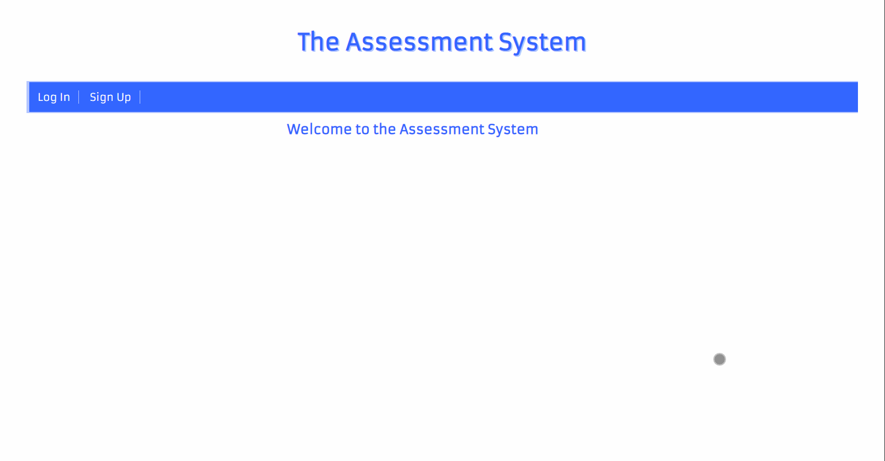
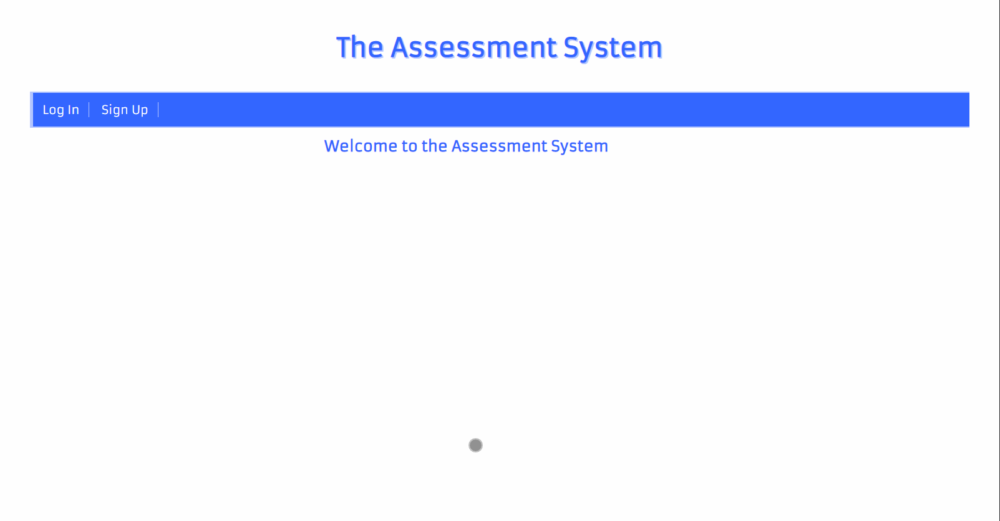
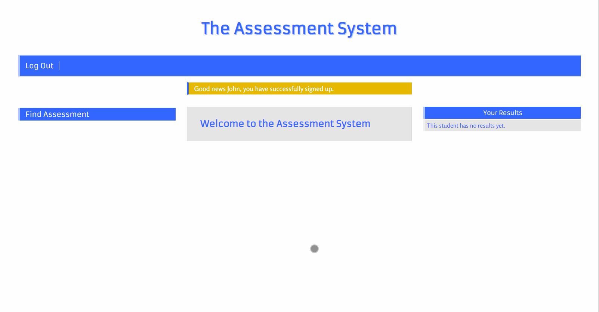
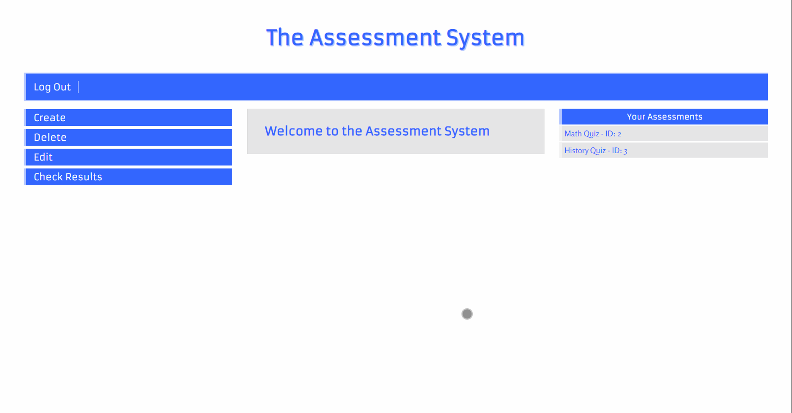
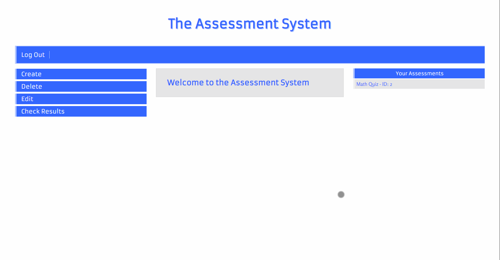
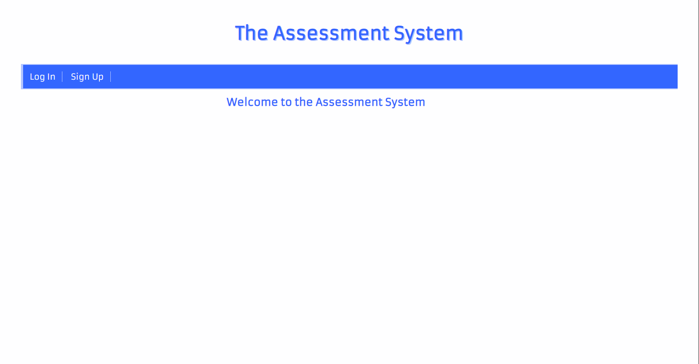

 # The Assessment System
 
 #### *A website for teachers and students that allows the former to create, delete and edit assessments, and the latter to carry them out.*
 
 ## As a student you will be able to:
 - Signup
 - Login
 - Carry out assessments
 - See all your assessments results
 
 ## As a teacher you will be able to:
 - Signup
 - Login
 - Create assessments
 - Edit assessments
 - Delete assessments
 - Check students results
 
 ## What is meant by assessment.
 An 'assessment' is made up of one or more 'problems'. Each problem can have an optional description, and must contain a question. Also, a problem must have at least two available answers, and one of them selected as the correct one.
 
 ## Known issues.
 At the moment it is possible to create a question with only one available answer. Also, when adding a problem to an assessment from the 'Edit Assessment' view, it is possible to create a problem without answers available. This issue has been partially fixed by informing the user with a message and a link reminding that answers should be created for the given problem.
 The problems will be next to be addressed in the schedule.
 
 ## Tools used in the development of this website.
 - Python 3.7
 - Django 3
 - HTML 5
 - CSS 
 - SQLite 3
 
 ## Coming next.
 1. Fix add problem with no answers available in edit view.
 2. Fix create/add problem with only one answer available.
 3. Write tests.
 
 ## Use Cases
 
 ##### Sign up as a Teacher
 
 
 ##### Sign up as a Student
 
 
 ##### Log out
 
 
 ## Teacher side
 
 ##### Create Assessment
 
 
 ##### Edit Assessment
 

 ##### Delete Assessment
  
  
 ##### Check Student Results
   
  
 ## Student side
 
 ##### Carry out assessment
  
